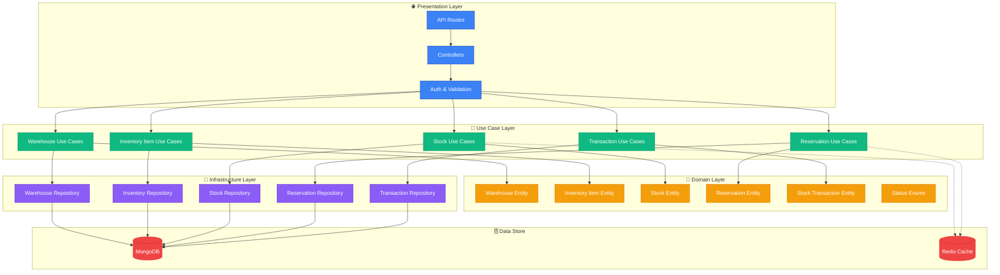
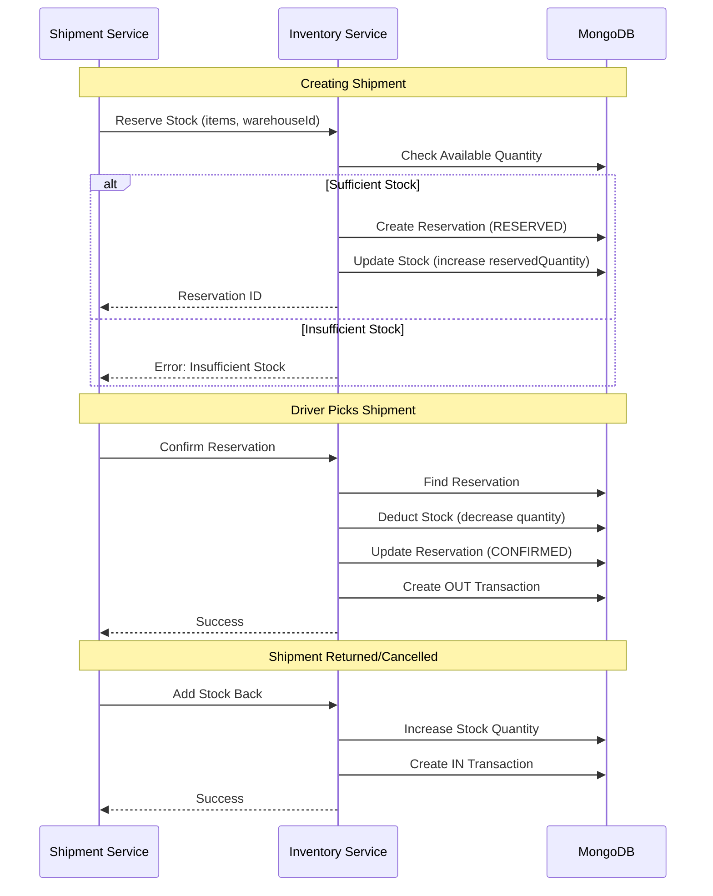

<div align="center">
  <h1>📦 Fleet OS Inventory Service</h1>
  <p>
    <strong>Warehouse & Stock Management Microservice</strong>
  </p>

[](https://opensource.org/licenses/ISC)


  <p>
    <a href="#-overview">Overview</a> •
    <a href="#-architecture">Architecture</a> •
    <a href="#-key-features">Features</a> •
    <a href="#-technology-stack">Tech Stack</a> •
    <a href="#-getting-started">Getting Started</a> •
    <a href="#-api-endpoints">API</a>
  </p>
</div>

---

## 📖 Overview

The **Fleet OS Inventory Service** is a comprehensive microservice for managing warehouses, inventory items, stock levels, and reservations within the Fleet OS platform. It provides real-time inventory tracking, automated stock reservations for shipments, and multi-warehouse support to ensure efficient logistics operations.

### 🎯 Purpose

This service serves as the central inventory management system, handling:

- **Warehouse Management**: Multi-location warehouse setup and configuration
- **Inventory Items**: Product catalog with SKU management
- **Stock Management**: Real-time stock levels across warehouses
- **Stock Reservations**: Automated reservation system for shipments
- **Transaction Tracking**: Complete audit trail of all stock movements
- **Stock Transfers**: Inter-warehouse stock movement management

---

## ✨ Key Features

### 🏭 Warehouse Management

- **Multi-Warehouse Support**: Manage unlimited warehouse locations
- **Warehouse Profiles**: Name, code, address, contact information
- **Capacity Tracking**: Monitor warehouse utilization
- **Status Management**: ACTIVE, MAINTENANCE, CLOSED, ARCHIVED states
- **Tenant Isolation**: Complete separation of warehouse data

### 📋 Inventory Item Management

- **Product Catalog**: Comprehensive item database with SKU tracking
- **Item Status**: ACTIVE, DISCONTINUED, ARCHIVED states
- **Unit of Measure (UOM)**: PCS, KG, L, BOX, M
- **Categorization**: Organize items for easy discovery
- **Reorder Levels**: Automated low-stock alerts
- **Multi-Warehouse Availability**: Track item distribution

### 📊 Stock Management

- **Real-Time Stock Levels**: Current quantity per warehouse per item
- **Stock Transactions**: IN, OUT, ADJUSTMENT, TRANSFER operations
- **Transaction History**: Complete audit trail with timestamps
- **Add Stock**: Receive inventory (IN transactions)
- **Remove Stock**: Issue inventory (OUT transactions)
- **Adjust Stock**: Correct discrepancies (ADJUSTMENT transactions)
- **Transfer Stock**: Move between warehouses (TRANSFER_OUT/TRANSFER_IN transactions)

### 🔒 Stock Reservations

- **Automated Reservations**: Reserve stock for pending shipments
- **Reservation Status**: RESERVED, CONFIRMED, RELEASED, EXPIRED
- **Expiration Management**: Automatic release of expired reservations
- **Confirmation Flow**: Convert reservations to actual stock deduction
- **Release Mechanism**: Return reserved stock to available inventory
- **Multi-Item Reservations**: Reserve multiple items in single transaction

### 📈 Advanced Features

- **Low Stock Alerts**: Automated notifications for reorder levels
- **Stock Valuation**: Track inventory value across warehouses
- **Multi-Tenant Support**: Complete data isolation per organization
- **Pagination & Search**: Efficient data retrieval for large inventories
- **Soft Delete**: Preserve data integrity with logical deletion

---

## 🏛 Architecture

Built on **Clean Architecture** with Domain-Driven Design principles.



### 🧠 Design Patterns

- **Clean Architecture**: Layered architecture with dependency inversion
- **Repository Pattern**: Abstract data persistence behind interfaces
- **Entity Pattern**: Rich domain models with business rules
- **Use Case Pattern**: Single-responsibility operations
- **DTO Pattern**: Zod schemas for validation and type safety

---

## 🛠 Technology Stack

| Category       | Technology                                                                                                      | Purpose                  |
| :------------- | :-------------------------------------------------------------------------------------------------------------- | :----------------------- |
| **Runtime**    |          | JavaScript runtime       |
| **Language**   |  | Type-safe development    |
| **Framework**  |        | Web framework            |
| **Database**   |           | Document database        |
| **Cache**      |                 | Caching & rate limiting  |
| **Validation** | **Zod**                                                                                                         | Runtime type checking    |
| **Logging**    | **Winston**                                                                                                     | Structured logging       |
| **Testing**    | **Jest**                                                                                                        | Unit & integration tests |

---

## 📂 Project Structure

```
fleet-os-inventory-service/
├── src/
│   ├── config/                      # ⚙️ Configuration
│   │   ├── database.ts              # MongoDB connection
│   │   ├── redis.ts                 # Redis client
│   │   └── env.ts                   # Environment validation
│   │
│   ├── domain/                      # 🎯 Core business domain
│   │   ├── entities/                # Domain entities
│   │   │   ├── warehouse.entity.ts
│   │   │   ├── inventory-item.entity.ts
│   │   │   ├── stock.entity.ts
│   │   │   ├── reservation.entity.ts
│   │   │   └── stock-transaction.entity.ts
│   │   ├── enums/                   # Domain enumerations
│   │   │   ├── warehouse-status.enum.ts
│   │   │   ├── inventory-item-status.enum.ts
│   │   │   ├── stock-transaction-type.enum.ts
│   │   │   ├── reservation-status.enum.ts
│   │   │   └── uom.enum.ts
│   │   ├── errors/                  # Custom domain errors
│   │   └── repositories/            # Repository interfaces
│   │
│   ├── use-cases/                   # 💼 Application business logic
│   │   ├── warehouse/
│   │   │   ├── create-warehouse/
│   │   │   ├── get-warehouse/
│   │   │   ├── list-warehouses/
│   │   │   ├── update-warehouse/
│   │   │   └── delete-warehouse/
│   │   ├── inventory-item/
│   │   │   ├── create-inventory-item/
│   │   │   ├── get-inventory-item/
│   │   │   ├── list-inventory-items/
│   │   │   └── update-inventory-item/
│   │   ├── stock/
│   │   │   ├── create-stock-record/
│   │   │   ├── get-stock/
│   │   │   ├── add-stock/
│   │   │   ├── remove-stock/
│   │   │   ├── adjust-stock/
│   │   │   └── transfer-stock/
│   │   ├── reservation/
│   │   │   ├── reserve-stock/
│   │   │   ├── confirm-reservation/
│   │   │   └── release-reservation/
│   │   └── stock-transaction/
│   │       ├── create-transaction/
│   │       └── list-transactions/
│   │
│   ├── infrastructure/              # 🏗️ External interfaces
│   │   ├── repositories/            # Data persistence
│   │   │   ├── warehouse.repository.ts
│   │   │   ├── inventory-item.repository.ts
│   │   │   ├── stock.repository.ts
│   │   │   ├── reservation.repository.ts
│   │   │   └── stock-transaction.repository.ts
│   │   └── models/                  # Mongoose schemas
│   │       ├── Warehouse.ts
│   │       ├── InventoryItem.ts
│   │       ├── Stock.ts
│   │       ├── Reservation.ts
│   │       └── StockTransaction.ts
│   │
│   ├── presentation/                # 🌐 API layer
│   │   ├── controllers/             # Request handlers
│   │   │   ├── warehouse.controller.ts
│   │   │   ├── inventory-item.controller.ts
│   │   │   ├── stock.controller.ts
│   │   │   ├── reservation.controller.ts
│   │   │   └── stock-transaction.controller.ts
│   │   ├── middlewares/             # Request processing
│   │   │   ├── auth.middleware.ts
│   │   │   ├── internal-auth.middleware.ts
│   │   │   └── validate.middleware.ts
│   │   └── routes/                  # API routes
│   │       ├── warehouse.routes.ts
│   │       ├── inventory-item.routes.ts
│   │       ├── stock.routes.ts
│   │       ├── reservation.routes.ts
│   │       └── stock-transaction.routes.ts
│   │
│   ├── di/                          # 💉 Dependency injection
│   │   └── container.ts
│   │
│   ├── app.ts                       # Express app setup
│   └── index.ts                     # Server entry point
│
├── tests/                           # 🧪 Test suites
├── .env.example                     # Environment template
├── Dockerfile                       # Production container
└── package.json
```

---

## 🚀 Getting Started

### Prerequisites

- **Node.js** >= 20.x
- **pnpm** >= 9.x
- **MongoDB** >= 6.x
- **Redis** >= 7.x (optional, for caching)

### Installation

1. **Clone the repository**

```bash
git clone https://github.com/ijas9118/fleet-os-inventory-service.git
cd fleet-os-inventory-service
```

2. **Install dependencies**

```bash
pnpm install
```

3. **Configure environment**

```bash
cp .env.example .env
# Edit .env with your configuration
```

4. **Run development server**

```bash
pnpm dev
```

The service will start on `http://localhost:3004` (or your configured port).

### Running Tests

```bash
# Run all tests
pnpm test

# Watch mode
pnpm test:watch

# Generate coverage report
pnpm test:coverage
```

### Building for Production

```bash
# Type check
pnpm typecheck

# Build
pnpm build

# Start production server
pnpm start
```

---

## 🔌 API Endpoints

Base URL: `/api/v1`

### 🏭 Warehouse Endpoints

| Method   | Endpoint          | Description              | Roles                         |
| :------- | :---------------- | :----------------------- | :---------------------------- |
| `POST`   | `/warehouses`     | Create new warehouse     | `TENANT_ADMIN`, `OPS_MANAGER` |
| `GET`    | `/warehouses`     | List all warehouses      | `TENANT_ADMIN`, `OPS_MANAGER` |
| `GET`    | `/warehouses/:id` | Get warehouse by ID      | `TENANT_ADMIN`, `OPS_MANAGER` |
| `PATCH`  | `/warehouses/:id` | Update warehouse details | `TENANT_ADMIN`, `OPS_MANAGER` |
| `DELETE` | `/warehouses/:id` | Delete warehouse (soft)  | `TENANT_ADMIN`                |

**Query Parameters:**

- `page` - Page number (default: 1)
- `limit` - Items per page (default: 10)
- `search` - Search by name or code
- `status` - Filter by warehouse status

### 📋 Inventory Item Endpoints

| Method   | Endpoint               | Description               | Roles                         |
| :------- | :--------------------- | :------------------------ | :---------------------------- |
| `POST`   | `/inventory-items`     | Create new inventory item | `TENANT_ADMIN`, `OPS_MANAGER` |
| `GET`    | `/inventory-items`     | List all inventory items  | `TENANT_ADMIN`, `OPS_MANAGER` |
| `GET`    | `/inventory-items/:id` | Get inventory item by ID  | `TENANT_ADMIN`, `OPS_MANAGER` |
| `PATCH`  | `/inventory-items/:id` | Update inventory item     | `TENANT_ADMIN`, `OPS_MANAGER` |
| `DELETE` | `/inventory-items/:id` | Delete item (soft)        | `TENANT_ADMIN`                |

**Query Parameters:**

- `page` - Page number (default: 1)
- `limit` - Items per page (default: 10)
- `search` - Search by name, SKU, or description
- `status` - Filter by item status

### 📊 Stock Endpoints

| Method | Endpoint                | Description                           | Roles                         |
| :----- | :---------------------- | :------------------------------------ | :---------------------------- |
| `POST` | `/stocks`               | Create stock record                   | `TENANT_ADMIN`, `OPS_MANAGER` |
| `GET`  | `/stocks`               | List all stock records (paginated)    | `TENANT_ADMIN`, `OPS_MANAGER` |
| `GET`  | `/stocks/:id`           | Get stock record by ID                | `TENANT_ADMIN`, `OPS_MANAGER` |
| `GET`  | `/stocks/warehouse/:id` | Get stock for specific warehouse      | `TENANT_ADMIN`, `OPS_MANAGER` |
| `POST` | `/stocks/add`           | Add stock (IN transaction)            | `TENANT_ADMIN`, `OPS_MANAGER` |
| `POST` | `/stocks/remove`        | Remove stock (OUT transaction)        | `TENANT_ADMIN`, `OPS_MANAGER` |
| `POST` | `/stocks/adjust`        | Adjust stock (ADJUSTMENT transaction) | `TENANT_ADMIN`, `OPS_MANAGER` |
| `POST` | `/stocks/transfer`      | Transfer between warehouses           | `TENANT_ADMIN`, `OPS_MANAGER` |

**Query Parameters:**

- `page` - Page number (default: 1)
- `limit` - Items per page (default: 10)
- `warehouseId` - Filter by warehouse
- `inventoryItemId` - Filter by inventory item

### 🔒 Reservation Endpoints (Internal)

These endpoints use **internal API key** authentication for service-to-service communication.

| Method | Endpoint                | Description                  | Authentication   |
| :----- | :---------------------- | :--------------------------- | :--------------- |
| `POST` | `/reservations/reserve` | Reserve stock for shipment   | Internal API Key |
| `POST` | `/reservations/confirm` | Confirm reservation (deduct) | Internal API Key |
| `POST` | `/reservations/release` | Release reservation          | Internal API Key |

### 📈 Stock Transaction Endpoints

| Method | Endpoint                  | Description           | Roles                         |
| :----- | :------------------------ | :-------------------- | :---------------------------- |
| `GET`  | `/stock-transactions`     | List all transactions | `TENANT_ADMIN`, `OPS_MANAGER` |
| `GET`  | `/stock-transactions/:id` | Get transaction by ID | `TENANT_ADMIN`, `OPS_MANAGER` |

**Query Parameters:**

- `page` - Page number (default: 1)
- `limit` - Items per page (default: 10)
- `warehouseId` - Filter by warehouse
- `inventoryItemId` - Filter by item
- `type` - Filter by transaction type

---

## 📝 Data Models

### Warehouse Entity

```typescript
{
  id: string;
  tenantId: string;
  name: string;                      // Warehouse name
  code: string;                      // Unique warehouse code
  address: {
    line1: string;
    city: string;
    state?: string;
    postalCode?: string;
    country: string;
  };
  contactPerson?: {
    name?: string;
    phone?: string;
    email?: string;
  };
  status: WarehouseStatus;           // ACTIVE, MAINTENANCE, CLOSED, ARCHIVED
  capacity?: number;                 // Maximum storage capacity
  metadata?: Record<string, any>;
  createdAt: Date;
  updatedAt: Date;
  deletedAt?: Date;
}
```

### Inventory Item Entity

```typescript
{
  id: string;
  tenantId: string;
  name: string;                      // Product name
  sku: string;                       // Stock Keeping Unit (unique)
  description?: string;
  category?: string;
  uom: UOM;                          // PCS, KG, L, BOX, M
  status: InventoryItemStatus;       // ACTIVE, DISCONTINUED, ARCHIVED
  reorderLevel?: number;             // Low stock threshold
  unitPrice?: number;
  metadata?: Record<string, any>;
  createdAt: Date;
  updatedAt: Date;
  deletedAt?: Date;
}
```

### Stock Entity

```typescript
{
  id: string;
  tenantId: string;
  warehouseId: string;
  inventoryItemId: string;
  quantity: number; // Current available quantity
  reservedQuantity: number; // Reserved for shipments
  availableQuantity: number; // quantity - reservedQuantity
  createdAt: Date;
  updatedAt: Date;
}
```

### Reservation Entity

```typescript
{
  id: string;
  tenantId: string;
  warehouseId: string;
  shipmentId?: string;               // Reference to shipment
  items: Array<{
    inventoryItemId: string;
    stockId: string;
    sku: string;
    quantity: number;
  }>;
  status: ReservationStatus;         // RESERVED, CONFIRMED, RELEASED, EXPIRED
  reservedAt: Date;
  expiresAt: Date;
  releasedAt?: Date;
  createdAt: Date;
  updatedAt: Date;
}
```

### Stock Transaction Entity

```typescript
{
  id: string;
  tenantId: string;
  warehouseId: string;
  inventoryItemId: string;
  type: StockTransactionType;        // IN, OUT, ADJUSTMENT, TRANSFER_OUT, TRANSFER_IN
  quantity: number;                  // Positive or negative
  notes?: string;
  referenceId?: string;              // Related shipment/order ID
  performedBy?: string;              // User who performed action
  createdAt: Date;
}
```

---

## 🔄 Stock Reservation Flow

The inventory service integrates with the shipment service through automated stock reservations:



---

## 🔐 Authentication & Authorization

This service supports **dual authentication mechanisms**:

### User Authentication (JWT)

- For tenant admin and operations manager access
- JWT tokens validated via middleware
- Role-Based Access Control (RBAC)

### Internal API Authentication

- For service-to-service communication (e.g., shipment service)
- API key-based authentication
- Used for reservation endpoints

**Authorization Roles:**

- `PLATFORM_ADMIN` - Full platform access
- `TENANT_ADMIN` - Tenant-wide management
- `OPERATIONS_MANAGER` - Inventory operations

---

## 🧪 Testing

The service includes comprehensive test coverage:

```bash
pnpm test              # Run all tests
pnpm test:watch        # Watch mode
pnpm test:coverage     # Generate coverage report
```

---

## 📊 Environment Variables

| Variable              | Description                | Required | Default       |
| :-------------------- | :------------------------- | :------- | :------------ |
| `NODE_ENV`            | Environment mode           | No       | `development` |
| `PORT`                | Server port                | No       | `3004`        |
| `DATABASE_URL`        | MongoDB connection string  | Yes      | -             |
| `REDIS_URL`           | Redis connection URL       | No       | -             |
| `INTERNAL_API_KEY`    | Service-to-service API key | Yes      | -             |
| `JWT_PUBLIC_KEY_PATH` | Path to JWT public key     | Yes      | -             |

---

## 🤝 Contributing

Contributions are welcome! Please follow these steps:

1. Fork the repository
2. Create a feature branch (`git checkout -b feature/amazing-feature`)
3. Commit your changes (`git commit -m 'Add amazing feature'`)
4. Push to the branch (`git push origin feature/amazing-feature`)
5. Open a Pull Request

---

## 📄 License

This project is licensed under the **ISC License**.

---

<div align="center">
  <p>Built with ❤️ for the Fleet OS Platform</p>
  <p>
    <a href="https://github.com/ijas9118/fleet-os-inventory-service">GitHub</a> •
    <a href="https://github.com/ijas9118/fleet-os-inventory-service/issues">Issues</a>
  </p>
</div>
